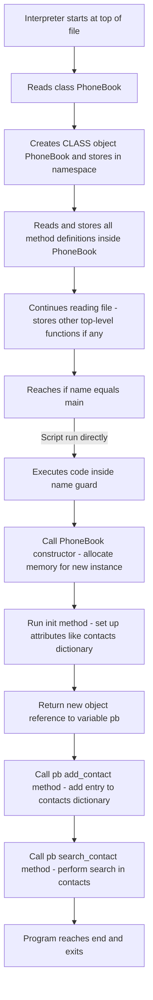

```
┌────────────────────────────────────────────────────────────┐
│ 1. Interpreter starts reading from the FIRST line          │
└────────────────────────────────────────────────────────────┘
       │
       ▼
[Line X] class PhoneBook:
       │   └── Class body is executed
       │       ├── Python creates a CLASS OBJECT named PhoneBook
       │       └── Stores it in memory (namespace)
       │
       ▼
[Line Y] def search_contact(...):
       │   └── Function is defined (stored in memory)
       │
       ▼
... (Other top-level definitions) ...
       │
       ▼
[Line N] if __name__ == "__main__":
       │   └── This condition is checked.
       │       If True (script run directly):
       │
       ▼
    pb = PhoneBook()
       │   ├── Calls the CLASS (PhoneBook)
       │   ├── Allocates memory for a new INSTANCE
       │   ├── Calls __init__(self)
       │   │     ├── Sets up attributes (contacts dict, etc.)
       │   │     └── Returns None
       │   └── The instance is now stored in variable `pb`
       │
       ▼
    pb.add_contact(...)
       │   └── Finds the `add_contact` method in the instance
       │   └── Executes it, adding data to pb.contacts
       │
       ▼
    pb.search_contact(...)
       │   └── Executes search logic
       │
       ▼
[End of file → Program exits]
```


